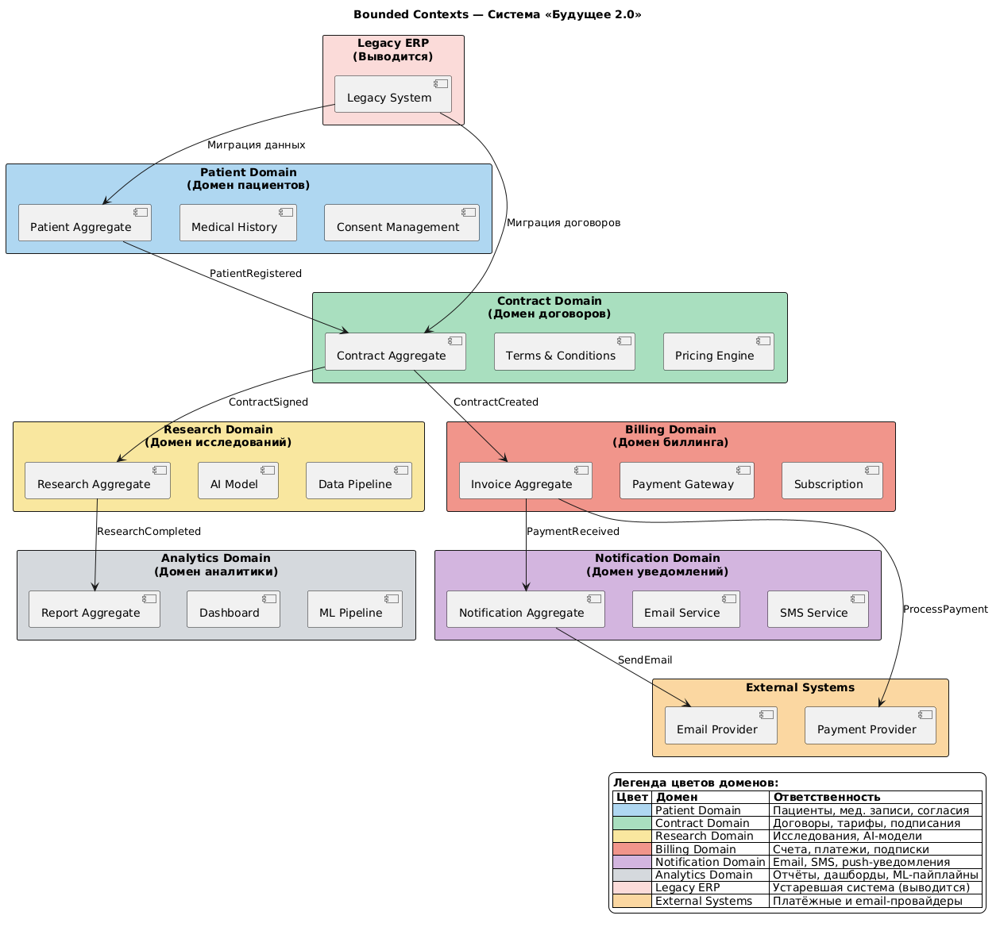
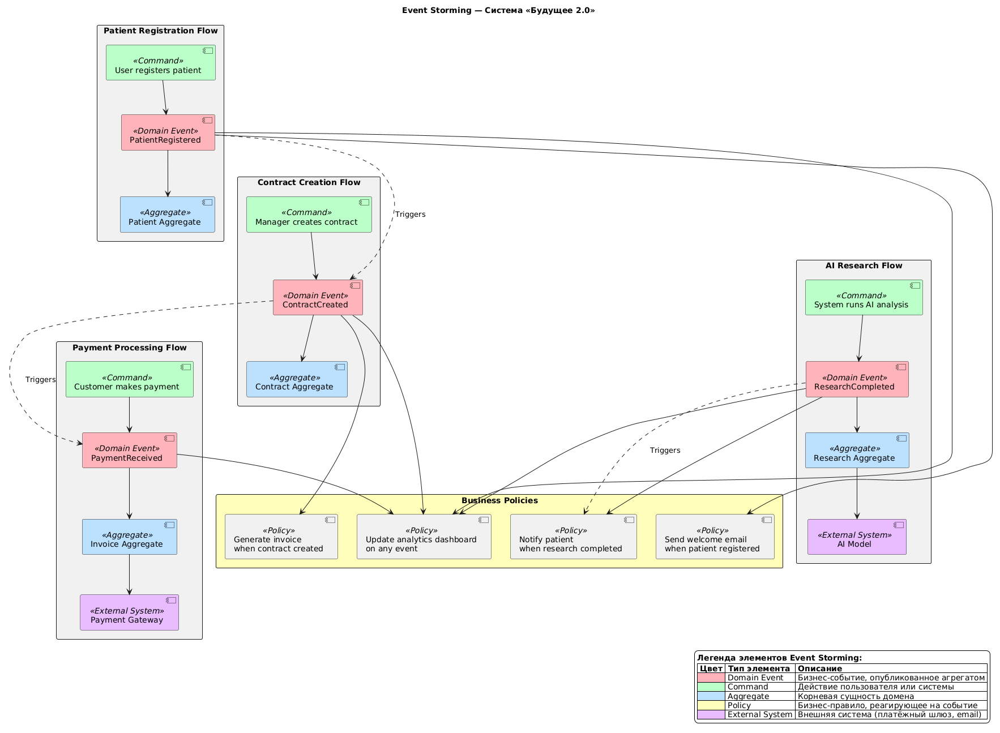

# 🎯 Task 4 Advanced: Моделирование домена и интеграций

##  Описание задания

Данный каталог содержит материалы по моделированию домена системы «Будущее 2.0» с использованием **Domain-Driven Design (DDD)** и проектированию **событийной архитектуры**.

**Цель задания:**
- Разделить систему на домены (bounded contexts)
- Определить агрегаты и их инварианты
- Спроектировать событийную архитектуру (Event Storming)
- Обосновать переход с Camel/DWH на событийный подход

---

## 📂 Структура артефактов

```
Task4Advanced/
├── diagrams/
│   ├── bounded-contexts.puml      # Исходный код диаграммы Bounded Contexts
│   ├── bounded-contexts.png       # Визуальное представление Bounded Contexts
│   ├── event-storming.puml        # Исходный код Event Storming диаграммы
│   └── event-storming.png         # Визуальное представление Event Storming
├── aggregates.md                  # Описание агрегатов (границы, инварианты, ключи)
├── events.yaml                    # Каталог доменных событий (YAML формат)
├── justification.md               # Обоснование событийного подхода vs Camel/DWH
└── README.md                      # Этот файл (главная точка входа)
```

---

## ️ 1. Bounded Contexts (Контексты домена)

### 📊 Диаграмма



🔗 **[Исходный код PlantUML](diagrams/bounded-contexts.puml)**

###  Легенда цветов

| Цвет | Домен | Ответственность |
|------|-------|-----------------|
| 🔵 Голубой (#AED6F1) | **Patient Domain** | Управление пациентами, медицинскими записями, согласиями |
| 🟢 Мятный (#A9DFBF) | **Contract Domain** | Создание и управление договорами, тарифными планами |
| 🟡 Жёлтый (#F9E79F) | **Research Domain** | Проведение исследований с использованием ИИ |
| 🔴 Лососевый (#F1948A) | **Billing Domain** | Выставление счетов, обработка платежей |
| 🟣 Лавандовый (#D2B4DE) | **Notification Domain** | Отправка уведомлений (email, SMS, push) |
|  Серый (#D5D8DC) | **Analytics Domain** | Генерация отчётов, дашборды, ML-пайплайны |
| 🟥 Бледно-красный (#FADBD8) | **Legacy ERP** | Устаревшая система (выводится из эксплуатации) |
| 🟧 Персиковый (#FAD7A0) | **External Systems** | Платёжные и email-провайдеры |

###  Что показывает эта диаграмма

**Bounded Contexts** — это ключевое понятие DDD, которое определяет границы, внутри которых определённая модель данных имеет конкретный смысл. Каждый контекст — это независимая бизнес-область со своей логикой.

#### Ключевые архитектурные решения:

1. **Разделение на 6 независимых доменов**
   - Каждый домен отвечает за одну бизнес-область
   - Домены слабо связаны (loose coupling) через события
   - Каждый домен может разрабатываться и развёртываться независимо

2. **Anti-Corruption Layer (ACL)**
   - Красные пунктирные линии показывают интеграцию с Legacy ERP
   - ACL защищает новую архитектуру от устаревших моделей данных
   - Постепенный вывод легаси через паттерн Strangler Fig

3. **Внешние интеграции**
   - Payment Provider — для обработки платежей
   - Email Provider — для отправки уведомлений
   - Интеграции изолированы в соответствующих доменах

4. **Потоки событий между доменами**
   ```
   PatientRegistered → ContractCreated → InvoiceGenerated → PaymentReceived
                                                    ↓
                                              ResearchCompleted → ReportGenerated
   ```

---

## 📨 2. Event Storming (Событийное моделирование)

### 📊 Диаграмма



 **[Исходный код PlantUML](diagrams/event-storming.puml)**

###  Легенда элементов

| Цвет | Тип элемента | Описание |
|------|--------------|----------|
| 🟢 Зелёный (#BAFFC9) | **Command** | Действие пользователя или системы (например, "User registers patient") |
| 🔴 Красный (#FFB3BA) | **Domain Event** | Бизнес-событие, опубликованное агрегатом (например, "PatientRegistered") |
| 🔵 Синий (#BAE1FF) | **Aggregate** | Корневая сущность домена, которая обрабатывает команды и публикует события |
| 🟡 Жёлтый (#FFFFBA) | **Policy** | Бизнес-правило, которое реагирует на события (автоматические действия) |
| 🟣 Фиолетовый (#E8BAFF) | **External System** | Внешняя система (платёжный шлюз, email-провайдер) |

### 🔄 Ключевые потоки событий

#### Поток 1: Регистрация пациента
```
[User registers patient] (Command)
        ↓
  PatientRegistered (Domain Event)
        ↓
  [Patient Aggregate]
        ↓
  [Send welcome email] (Policy)
```

**Что происходит:**
1. Пользователь регистрирует пациента
2. Система публикует событие `PatientRegistered`
3. Агрегат Patient сохраняет данные
4. Автоматически отправляется welcome email

---

#### Поток 2: Создание договора
```
[Manager creates contract] (Command)
        ↓
  ContractCreated (Domain Event)
        ↓
  [Contract Aggregate]
        ↓
  [Generate invoice] (Policy)
```

**Что происходит:**
1. Менеджер создаёт договор
2. Публикуется событие `ContractCreated`
3. Агрегат Contract сохраняет договор
4. Автоматически генерируется счёт

---

#### Поток 3: Обработка платежа
```
[Customer makes payment] (Command)
        ↓
  PaymentReceived (Domain Event)
        ↓
  [Invoice Aggregate]
        ↓
  [Payment Gateway] (External System)
```

**Что происходит:**
1. Клиент совершает платёж
2. Публикуется событие `PaymentReceived`
3. Агрегат Invoice обновляет статус
4. Платёж обрабатывается через внешний шлюз

---

#### Поток 4: Исследование ИИ
```
[System runs AI analysis] (Command)
        ↓
  ResearchCompleted (Domain Event)
        ↓
  [Research Aggregate]
        ↓
  [AI Model] (External System)
        ↓
  [Notify patient] (Policy)
```

**Что происходит:**
1. Система запускает AI-анализ
2. После завершения публикуется `ResearchCompleted`
3. Агрегат Research сохраняет результаты
4. Пациент получает уведомление о готовности

---

### 🎯 Бизнес-правила (Policies)

На диаграмме показаны автоматические реакции на события:

| Policy | Триггер | Действие |
|--------|---------|----------|
| **Send welcome email** | PatientRegistered | Отправка приветственного email |
| **Generate invoice** | ContractCreated | Создание счёта для оплаты |
| **Notify patient** | ResearchCompleted | Уведомление о готовности результатов |
| **Update analytics dashboard** | Любое событие | Обновление дашбордов в реальном времени |

---

## 📚 3. Детальные описания

###  Агрегаты

**Файл:** [aggregates.md](aggregates.md)

Описание всех агрегатов с указанием:
- Границ агрегата (что включено, что нет)
- Инвариантов (бизнес-правила, которые всегда должны выполняться)
- Ключевых методов (на примере Go-кода)
- Публикуемых событий

**Пример агрегата Patient:**
```go
type PatientAggregate struct {
    ID        uuid.UUID
    Email     string
    Consents  []ConsentRecord
    History   []MedicalRecord
}

// Инвариант: согласие должно быть получено до создания записи
func (p *PatientAggregate) AddMedicalRecord(record MedicalRecord) error {
    if !p.hasConsent() {
        return errors.New("consent required")
    }
    // ...
}
```

---

### 📨 Каталог событий

**Файл:** [events.yaml](events.yaml)

Полный каталог из **10 доменных событий** в машиночитаемом YAML-формате:

| Событие | Источник | Подписчики | Критичность |
|---------|----------|------------|-------------|
| PatientRegistered | Patient Domain | Contract, Notification, Analytics | Высокая |
| ContractCreated | Contract Domain | Billing, Notification, Analytics | Высокая |
| ContractSigned | Contract Domain | Research, Billing, Notification | Высокая |
| PaymentReceived | Billing Domain | Contract, Notification, Analytics | Высокая |
| ResearchStarted | Research Domain | Notification, Analytics | Средняя |
| ResearchCompleted | Research Domain | Notification, Analytics, Billing | Высокая |
| ResearchFailed | Research Domain | Notification, Analytics | Средняя |
| InvoiceGenerated | Billing Domain | Notification, Analytics | Высокая |
| NotificationSent | Notification Domain | Analytics | Низкая |
| ReportGenerated | Analytics Domain | Notification | Низкая |

**Преимущества YAML-формата:**
- ✅ Машиночитаемый — можно парсить в CI/CD
- ✅ Валидируемый — можно проверить схему
- ✅ Компактный — меньше дублирования, чем JSON
- ✅ Интегрируемый — можно использовать для генерации кода

---

### ⚖️ Обоснование событийного подхода

**Файл:** [justification.md](justification.md)

Детальное сравнение **Camel + DWH** vs **Event-Driven Architecture**:

| Критерий | Camel + DWH | Event-Driven | Улучшение |
|----------|-------------|--------------|-----------|
| Time-to-market | 2-3 месяца | 1-2 недели | **10x быстрее** |
| Доступность | 95% | 99.9% | **+4.9%** |
| Задержка данных | 24 часа | < 1 секунда | **86400x быстрее** |
| Время диагностики | 4 часа | 15 минут | **16x быстрее** |

**Ключевые бизнес-преимущества:**
1. 🚀 Ускорение вывода новых продуктов (ROI 12x)
2. 🎯 Персонализация услуг (+25% к конверсии)
3. ⚡ Оперативное реагирование (-90% потерь от простоев)
4. 📋 Соответствие регуляторам (избежание штрафов до 500 млн рублей)
5. 🔗 Гибкость интеграций (ускорение партнёрств на 12x)

---

## ✅ Чек-лист для ревьюера

- [x] **Bounded contexts** определены для каждого домена (6 доменов)
- [x] **Агрегаты** описаны с указанием границ и инвариантов (`aggregates.md`)
- [x] **Event Storming диаграмма** отражает основные события и потоки
- [x] **Каталог событий** содержит контракты и подписчиков (`events.yaml`)
- [x] **Обоснование** событийного подхода vs Camel/DWH представлено (`justification.md`)
- [x] **Бизнес-преимущества** количественно оценены
- [x] **План миграции** с этапами и сроками описан
- [x] **Метрики успеха** определены (технические и бизнес-метрики)

---

## 🎓 Ключевые концепции DDD, использованные в проекте

### Bounded Context
Граница, внутри которой определённая модель данных имеет конкретный смысл. Например, "Patient" в Patient Domain — это медицинская карта, а в Billing Domain — это плательщик.

### Aggregate
Кластер объектов, которые рассматриваются как единое целое. Агрегат имеет корневую сущность (Aggregate Root) и гарантирует целостность инвариантов.

### Domain Event
Событие, которое произошло в домене и важно для других доменов. Например, `PatientRegistered` важно для Billing (создать счёт) и Notification (отправить email).

### Event Storming
Метод коллективного проектирования, где команда визуализирует потоки событий, команды и агрегаты на временной шкале.

### Anti-Corruption Layer (ACL)
Паттерн для интеграции с legacy-системами, который защищает новую архитектуру от устаревших моделей данных.

---