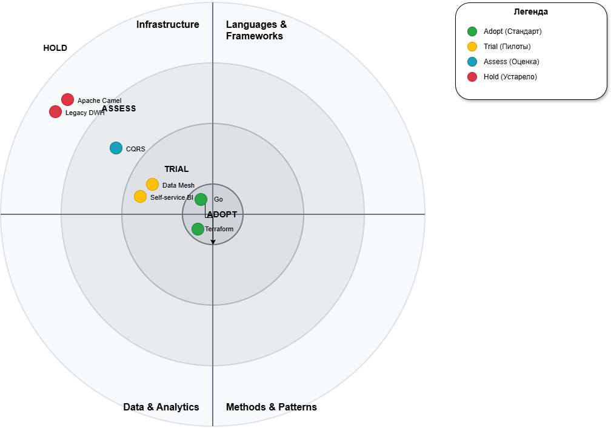

# 📡 Расширенный технический радар (Extended Tech Radar)

Данный документ описывает целевой технологический ландшафт компании «Будущее 2.0». Радар включает не только технологии, но и архитектурные паттерны, оцениваемые по 4 квадрантам готовности к внедрению.

---

## 🖼️ Визуализация радара

🔗 **[Скачать исходный файл диаграммы (draw.io)](tech-radar.drawio)**  
*(Для просмотра и редактирования откройте файл на [app.diagrams.net](https://app.diagrams.net/) или в десктопном приложении draw.io)*

---

## 📖 Легенда статусов

| Статус | Значение | Действие |
| :--- | :--- | :--- |
| 🟢 **Adopt** (Принять) | Доказали эффективность, используются как корпоративный стандарт. | Активно внедрять во все новые проекты. |
| 🟡 **Trial** (Опробовать) | Успешно используются в пилотных проектах, готовятся к масштабированию. | Использовать в новых проектах с осторожностью, собирать фидбек. |
| 🔵 **Assess** (Оценить) | Перспективные технологии, требуют изучения, PoC и оценки рисков. | Выделить время на исследование и создание прототипов. |
| 🔴 **Hold** (Удерживать) | Устаревшие или проблемные решения. Новые проекты на них не начинаются. | Плановый вывод из эксплуатации (Strangler Fig), поддержка только legacy. |

---

## 📊 Детальная расшифровка по категориям

### 🏗️ 1. Архитектурные паттерны и методологии

| Статус | Паттерн / Методология | Обоснование для «Будущее 2.0» |
| :--- | :--- | :--- |
| 🟢 **Adopt** | **Event-Driven Architecture (EDA)** | Основной стиль интеграции микросервисов. Обеспечивает слабую связность, асинхронность и отказоустойчивость (замена синхронному Camel). |
| 🟢 **Adopt** | **Infrastructure as Code (IaC)** | Terraform как единый стандарт развертывания. Гарантирует идемпотентность, версионирование и воспроизводимость окружений. |
| 🟡 **Trial** | **Data Mesh** | Децентрализованное управление данными. Домены (Patient, Contract) сами отвечают за качество и публикацию своих Data Products. |
| 🟡 **Trial** | **Self-service BI** | Передача аналитики бизнес-пользователям через Yandex DataLens с использованием готовых, доверенных Data Products. |
| 🔵 **Assess** | **CQRS** | Оценивается для высоконагруженных читаемых эндпоинтов (отделение моделей записи от чтения для оптимизации производительности). |
| 🔴 **Hold** | **Enterprise Service Bus (ESB) / Apache Camel** | Централизованная шина создает единое узкое горлышко и каскадные сбои. Заменяется на асинхронную событийную шину (Yandex MQ). |
| 🔴 **Hold** | **Монолитный DWH (Legacy)** | Жесткая ETL-зависимость и задержка данных (24 часа). Заменяется на Data Mesh + Stream Processing. |

---

### 💻 2. Разработка и языки программирования

| Статус | Технология | Обоснование для «Будущее 2.0» |
| :--- | :--- | :--- |
| 🟢 **Adopt** | **Go (Golang)** | Основной язык для высоконагруженных, конкурентных микросервисов (Patient, Contract, Billing domains). |
| 🟢 **Adopt** | **Python** | Корпоративный стандарт для Data Engineering, ML-моделей и скриптов автоматизации (Research Domain). |
| 🟡 **Trial** | **GraphQL** | Опробуется для BFF (Backend-for-Frontend) слоя, чтобы гибко агрегировать данные из разных доменов для UI без over-fetching. |
| 🔴 **Hold** | **PHP / Java (Legacy Monolith)** | Поддержка только в режиме bug-fixing до полного вывода из эксплуатации по паттерну Strangler Fig. |

---

### ☁️ 3. Инфраструктура и Облако (Yandex Cloud)

| Статус | Технология | Обоснование для «Будущее 2.0» |
| :--- | :--- | :--- |
| 🟢 **Adopt** | **Yandex Managed Kubernetes (MK8s)** | Оркестрация микросервисов, автомасштабирование (HPA), самовосстановление и гибкое управление ресурсами. |
| 🟢 **Adopt** | **Yandex Managed PostgreSQL** | Основное реляционное хранилище для транзакционных данных доменов. |
| 🟢 **Adopt** | **Yandex Object Storage (S3)** | Хранение неструктурированных данных, бэкапов, state-файлов Terraform и артефактов ML-моделей. |
| 🟡 **Trial** | **Yandex Message Queue (Kafka-compatible)** | Брокер сообщений для реализации Event-Driven архитектуры и гарантированной доставки событий. |
| 🔵 **Assess** | **Serverless (Yandex Cloud Functions)** | Оценивается для редких, событийно-триггерных задач (например, обработка вебхуков от внешних систем), чтобы не держать работающие контейнеры. |
| 🔴 **Hold** | **On-premise Виртуализация** | Полный переход на облачную модель (Cloud-native) для снижения CAPEX и роста операционной гибкости. |

---

### 📊 4. Данные и Аналитика

| Статус | Технология | Обоснование для «Будущее 2.0» |
| :--- | :--- | :--- |
| 🟡 **Trial** | **Yandex DataLens** | Self-service BI инструмент для визуализации Data Products напрямую бизнес-пользователям без участия IT-очередей. |
| 🔵 **Assess** | **Data Lakehouse (ClickHouse + S3)** | Оценивается как единое хранилище для аналитики, сочетающее гибкость Data Lake и производительность колоночных СУБД. |
| 🔴 **Hold** | **Традиционные ETL-пайплайны (Nightly Batch)** | Заменяются на Stream Processing (обработка событий в реальном времени) для снижения Time-to-Insight. |

---

## 🔗 Связь с другими артефактами

- Данный радар является основой для **[TCO-анализа](tco-analysis.md)**, так как переход из статуса *Hold* в *Adopt* напрямую влияет на статьи затрат (лицензии, инфраструктура, время команды).
- Паттерны *Adopt* и *Trial* (Data Mesh, EDA) детально расписаны в **[Стратегическом роадмапе](roadmap.md)**.